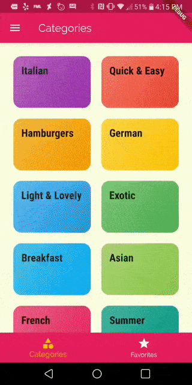
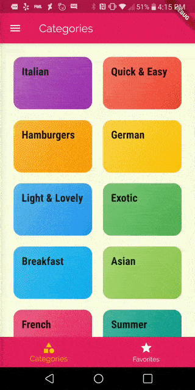

# delimeals
This is a meal recipe app with filters and navigation. You can change the filters to only look at certain types of receipes (e.g. vegan only), and you can add recipes to your Favorites section.

I followed Adademind's Flutter & Dart- The Complete Guide tutorial to make this. This is part of his Navigation module.

# How to Install
Open in Visual Studio Code, and run `flutter pub get` to get packages

Ctrl + F5 or `flutter run` to open the app on a real android/iphone device or a simulator.

# Preview
You can favorite a meal.

Or you can filter the meals.

#What I Learned

## Setting up the page
- Add const to things that won't be rebuilt (eg title appbar)
- How to make a container clickable? Wrap it in a GestureDetector or Inkwell (gesturedector with ink effect)

## Navigation basics
- Screens (or Routes, Pages) are widgets
- Flutter Navigator lets you switch (push/pop/replace) between pages
- Named routes (preferred) or unnamed routes
- Named route: Make new dart file and give it a name (like title in webpage)
`static const routeName = '/meal-detail';`

## Tabs
- You can add tabs in AppBar or at bottom of page (like a footer)
- Tabs let you switch between different stacks (no popping)

## Drawers and Dialogs
- Drawers (side menus, similar to navbar) let you switch between different stacks
- Drawers and other dialogs (alerts, modal bottom sheet) can be closed via Navigator.pop() 

## Passing Data
- Data can be passed via arguments
- Data can be passed back too (read via Future)
- Data can be strings, ints, objects (anything)

## Future

If we went to a meal item detail, we want to go back and not see that specific meal item in the meal list (how do we do it? use pop and then)

You can pass data around with pop method, and retrieve it with .then method on pushNamed. (Function runs when the page you pushed to is removed.)

you push a page, once page is popped, the function is executed
then() triggers fn as soon as you leave (pop) the new screen that was loaded via push()
(it's NOT that you push it, and then the result happens. only happens once page is popped)

pushNamed returns a future

**Futures** are objects that allow you to specify a function once they're done with a certain operation (eg the operation is displaying a page we're going to)

once the user goes back from meals detail screen, pushNamed is done b/c it just finished displaying that screen and the screen is not needed anymore. the future returned by pushnamed lets you know once the page you pushed to is not displayed anymore. Then you can add the result (to the pop method, as we're doing here)

### Q: How can you retrieve the data passed back via Navigator.of(context).pop('some data')?
You can retrieve it as an argument to the function you use in then() after push()/pushNamed() etc
The data you pass to pop() is automatically passed into the function (as an argument) that executes inside of then() once pop() is triggered.
